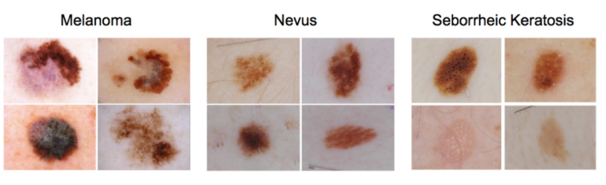

# Dermatologist AI

# Introduction
An algorithm that can visually diagnose melanoma, the deadliest form of skin cancer. In particular, algorithm will distinguish this malignant skin tumor from two types of benign lesions (nevi and seborrheic keratoses).

The data and objective are pulled from the 2017 ISIC Challenge on Skin Lesion Analysis Towards Melanoma Detection. As part of the challenge, participants were tasked to design an algorithm to diagnose skin lesion images as one of three different skin diseases (melanoma, nevus, or seborrheic keratosis). In this project, you will create a model to generate your own predictions.



# Team Members 

* Vignesh C
* Shyam Sundar V [shyamStarwalt](https://github.com/shyamStarwalt)

# Getting Started
Clone the repository and create a data/ folder to hold the dataset of skin images.

```
git clone https://github.com/udacity/dermatologist-ai.git
mkdir data; cd data
```
Create folders to hold the training, validation, and test images.

```
mkdir train; mkdir valid; mkdir test
```
Download and unzip the [training data](https://s3-us-west-1.amazonaws.com/udacity-dlnfd/datasets/skin-cancer/train.zip) (5.3 GB).

Download and unzip the [validation data](https://s3-us-west-1.amazonaws.com/udacity-dlnfd/datasets/skin-cancer/validation.zip)(824.5 MB).

Download and unzip the [test data](https://s3-us-west-1.amazonaws.com/udacity-dlnfd/datasets/skin-cancer/test.zip) (5.1 GB).

Download the checkpoint [from here](https://drive.google.com/file/d/1oiJJVZ1aOyqyhPRB2YALbmv9qn89aAAB/view?usp=sharing)


Place the training, validation, and test images in the `data/` folder, at `data/train/`, `data/valid/`, and `data/test/`, respectively. Each folder should contain three sub-folders `(melanoma/, nevus/, seborrheic_keratosis/)`, each containing representative images from one of the three image classes.

### Prerequisites

* Python 3.
* Numpy 
* Pandas
* MatPlotLib
* OpenCv
* Pytorch. 

## Project Instruction

### Instructions
1. Clone the repository and navigate to the downloaded folder.

	```	
	git clone https://github.com/shyamStarwalt/Dermatologist-AI.git
	cd cancer_detection
	```
2. Open the cancer_detection.ipynb

	```
	jupyter notebook cancer_detection.ipynb	
	```
3. Read and follow the instructions! This repository doesn't include any dataset you need. You can check out the getting started to download them.

## Project Information

### Contents

- Intro
- Step 0: Import Datasets
- Step 1: Detect type of skin cancer
- Step 2: Create a CNN to Classify Dog Breeds (using Transfer Learning)
- Step 3: Write Your Algorithm
- Step 4: Test Your Algorithm

# Getting your Results

## Losses

### Transfer model:
Training loss: 0.841 ... Validation loss: 0.521 

### Transfer model:
Accuracy : 65%
